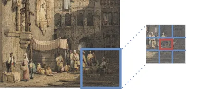
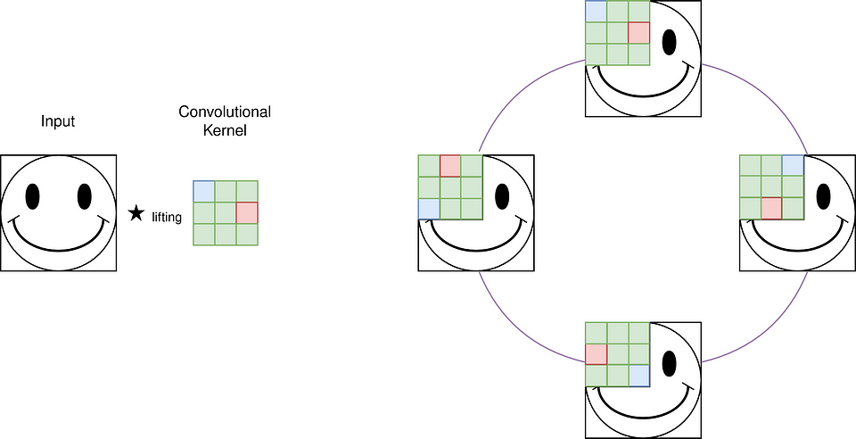
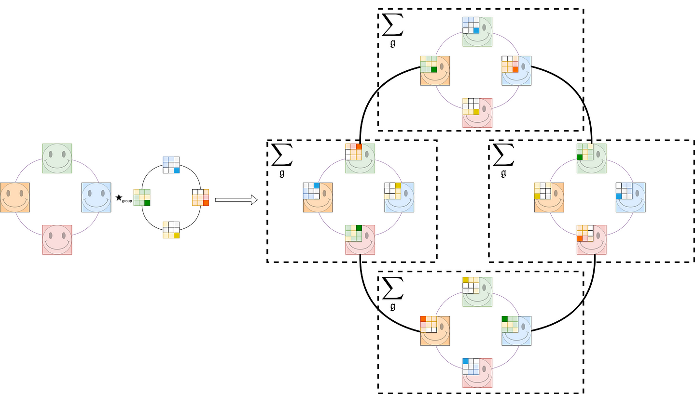
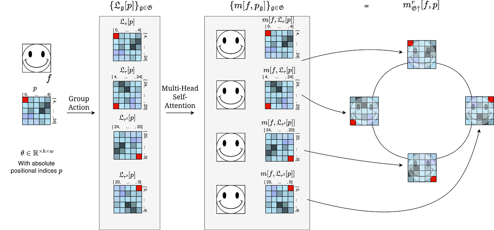

# Geometric Deep Learning: CNNs & Self-Attention

.gif)

In the following , we will see the benefits of injecting geometric priors into the transformer model.
The approach we discuss is introduced in a paper of David Romero et al.
To this end we will go through the following concepts:
- Convolutional- and Self-Attention Neural Networks
- Stand-Alone Self-Attention Transformer for Vision
- Group Theory Fundamentals
- Group Convolution  and Group Self-Attention

Note that this article is suppoused to be a technical deep dive - please find [..] for a higher level overview.

### Motivation
Even though the application of transformers in the vision domain shows promising results, they still can not compete with the best performing models of the domain, which are mainly based on CNNs.
One reason is that CNNs have a natural geometric prior, that is translation equivariance. Further, they are already extended by using group theory. See for example group convolution.
A natural idea would be to inject those same geometric priors into the self-attention operation of the transformer. Luckily, this is possible, and in this article we will figure out how.

## Convolutional Neural Networks and Self-Attention Networks

Both, Convolutional Neural Networks (CNNs) and Self-Attention Networks - that appear often in the form of Vision Transformers (ViT) - are successful neural architectures in the fields of computer vision, natural language processing and beyond.

We will review the main ideas of both and then slowly build our way up to extend them with geometric priors by using group theory.

### Convolutional Neural Networks
Convolutional Neural Networks (CNNs) are introduced in [] and are still a popular contestant among state-of-the-art vision models.
Their main idea builds around the idea of the convolution operation.
It is one of the first and most successful neural architectures, which follows the blueprint of Geometric Deep Learning. Due to the way the translation operation is defined, CNNs are translation invariant which turns out to be a very useful property especially in the vision domain.

#### Convolution Operation
The central idea of CNNs is the convolution operation. A convolution is a mathematical operation on two functions that produces a third function expressing how the shape of one is modified by the other. The term convolution refers to both the result function and to the process of computing it.
> Note that the inverse of the convolution operation is called cross-correlation and they are sometimes used interchangably which is the cause of some confusion.

On a continious space, it is defined as the integral of the product of the two functions after one is reversed and shifted.
$$f*g = \int_{-\infty}^{\infty} f(\tau)g(t-\tau)d\tau$$
In the context of CNNs, the convolution operation is defined as the element-wise discrete multiplication of a filter $$w$$ with a local receptive field $$x$$, followed by a summation over all elements of the receptive field.
$$y = w * x = \sum_{i=1}^{N} w_i x_i$$
The filter $$w$$ is also called kernel and is usually of smaller size than the input $$x$$.
Essentially, the convolution operation is a linear operation, which is applied to a local receptive field of the input. The local receptive field is shifted over the input and the operation is applied again. This is illustrated in the following figure.

> While in the figure, there are multiple pixels in each square, in reality, we either only have one pixel per square or we use a pooling operation to group multiple pixels together before we apply the convolution operation.

### Self-Attention Networks

Self-Attention Networks are introduced in [] and are the main building block of the Transformer model.

#### Self-Attention Operation
The self-attention operation is defined as $$\text{self-attention}(q,k,v) = \text{softmax}(\frac{qk^T}{\sqrt{d_k}})v$$, where $$q$$, $$k$$ and $$v$$ are the query, key and value vectors respectively.

The self-attention operation which is the engine of the transformer model is very versatile and can be used in many different ways and domains. In the following, we will focus on the application of self-attention in the vision domain.

In that case the self-attention operation is either applied to a local receptive field of the input similar as for CNNs or to the whole input. In the latter case, the self-attention operation is called global self-attention.

#### Stand-Alone Self-Attention for Vision
As it is introduced in [1], the work-horse of this concept  is the self-attention operation applied to a local receptive field N-k.
Self-Attention for a specific output $yᵢⱼ$ a former article (Stand-Alone Self-Attention for Vision from Scratch) I explain this concept in more detail and show how to implement it in PyTorch.
In the following, we will extend this concept by using group theory to induce geometric priors.

## Group Equivariant Networks

Group Equivariant Networks extend neural architecutres by using group theory to induce geometric priors. They can drastically reduce the number of parameters and improve the performance and sample efficiency of a model

Why group theory?
Group theory is a branch of mathematics that studies symmetry, and it is a powerful tool for understanding the structure of objects and their transformations. We essentially leverage the mathematical tools of group theory to induce geometric priors into neural networks.

### Group Theory Fundamentals

Group Theory, with its roots in mathematics, provides a formal framework for understanding symmetries and transformation. Leveraging group theory in neural networks allows us to imbue them with desirable properties, such as equivariance to transformations, which we also refer to as geometric priors.

Let us start with the mathematical definition of a group.
A group is a set $$\mathfrak{G}$$  along with a binary operation $$\circ : \mathfrak{G} × \mathfrak{G} \rightarrow \mathfrak{G}$$ called composition (for brevity we write $$\mathfrak{g} \mathfrak{h}$$ instead of $$\mathfrak{g} \circ \mathfrak{h}$$) satisfying the following axioms:
- Associativity: $(\mathfrak{g} \mathfrak{h})\mathscr{k} = \mathfrak{g}(\mathfrak{h}\mathscr{k})$ for all $\mathfrak{g}, \mathfrak{h}, \mathscr{k} \in \mathfrak{G}$.
- Identity: there exists a unique $\mathfrak{e} \in \mathfrak{G}$ satisfying $\mathfrak{e}\mathfrak{g} = \mathfrak{g}\mathfrak{e} = \mathfrak{g}$ for all $\mathfrak{g} \in \mathfrak{G}$.
- Inverse: For each $\mathfrak{g} \in \mathfrak{G}$ there is a unique inverse $\mathfrak{g}^{-1}  \mathfrak{G} \text{ s.t. } \mathfrak{g} \mathfrak{g}^{-1} = \mathfrak{g}^{-1}\mathfrak{g} = \mathfrak{e}$.
- Closure: The group is closed under composition, i.e., for every $\mathfrak{g}, \mathfrak{h} \in \mathfrak{G}$, we have $\mathfrak{g}\mathfrak{h} \in \mathfrak{G}$.

Note that if additionally commutativity ($$\mathfrak{g}\mathfrak{h}=\mathfrak{h}\mathfrak{g}$$) holds, then our group is called an Abelian group.

### Group Convolutional Neural Networks

Group Convolutional Neural Networks (G-CNNs), introduced in [], are a generalization of CNNs, which are equivariant to the action of a group $$\mathfrak{G}$$.
In the following, we will focus on the case of $$\mathfrak{G}$$ being a discrete group, which is the case for many of the common groups used in G-CNNs.

#### Group Convolution Operation

The group convolution operation is defined as $$f * g = \sum_{\mathfrak{g} \in \mathfrak{G}} f(\mathfrak{g}^{-1} \cdot x) g(\mathfrak{g})$$, where $$f$$ is the input, $$g$$ is the filter and $$\mathfrak{g}$$ is an element of the group $$\mathfrak{G}$$.

The group convolution operation is a generalization of the convolution operation, which is equivariant to the action of the group $$\mathfrak{G}$$.

Essentially, we lift the convolution operation to the group level by creating acted versions of the convolutional filter for every element of the group $$\mathfrak{G}$$.

*Lifting Convolution for the group of 90-degree rotations $$C_4$$.*

As you can see, for the lifting convolution, we create acted versions of the filter for every element of the group $$\mathfrak{G}$$ and then apply the convolution operation to the input $$f$$ and the acted filter $$g(\mathfrak{g})$$. In this particular example, we have the group of 90-degree rotations. That is why we end up with 4 acted versions of the filter, each a 90-degree rotation of the previous one.

... Add more math ....

Now that we lifted our input to the dimension of the group, we can now longer apply the lifting convolution as before.
Instead, we have to apply the so-called group convolution operation that acts on the lifted input and the lifted filter.

*Group Convolution for the group of 90-degree rotations $$C_4$$.*

As can be seen, the group convolution operation is defined as $$f * g = \sum_{\mathfrak{g} \in \mathfrak{G}} f(\mathfrak{g}^{-1} \cdot x) g(\mathfrak{g})$$, where $$f$$ is the input, $$g$$ is the filter and $$\mathfrak{g}$$ is an element of the group $$\mathfrak{G}$$.
Essentially, we apply the convolution operation to the lifted input $$f(\mathfrak{g}^{-1} \cdot x)$$ and the lifted filter $$g(\mathfrak{g})$$ for every element of the group $$\mathfrak{G}$$. Then we take the sum so the output is again of the same dimension as the input.

### Group Equivariant Self-Attention

Remember that self-attention is defined as $$\text{self-attention}(q,k,v) = \text{softmax}(\frac{qk^T}{\sqrt{d_k}})v$$.

Further, group equivariant self-attention is defined as..

*Lifting Self-Attention for the group of 90-degree rotations $$C_4$$.*